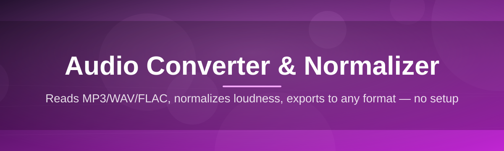

# audio-converter-utility 🎧🔊

  

*Drop in a messy folder of audio, walk away, come back to a clean, level, perfectly-formatted library.*

  

---

## 🌊 Overview

**audio-converter-utility** is a desktop-first toolkit built for one very specific headache: audio files that are all in different formats, all at wildly different volumes, and all demanding to be dealt with *right now*. Podcasters juggling raw WAV exports, musicians bouncing stems from three different DAWs, archivists digitizing decades of tape, and streamers who just want their clips to stop clipping — this tool exists because "just open it in an editor" stops scaling somewhere around file number twelve.

At its core, this is an **audio converter and normalizer** rolled into a single lightweight Windows application. Conversion handles the format chaos (MP3, WAV, FLAC, AAC, OGG, and friends), while normalization handles the *loudness* chaos — bringing tracks up to a consistent perceived volume without introducing distortion or pumping artifacts. Think of it as a librarian for your sound files: it doesn't just move things around, it makes sure every file on the shelf actually sounds like it belongs next to the others.

The project was built with a batch-first mindset. Selecting one file at a time to convert or normalize is fine for a hobby project, but the moment you have a folder of 40+ recordings, you need something that treats your whole library as a single job, not forty separate ones. That's the gap this tool fills — no bloated DAW required, no subscription, no cloud upload of your audio.

---

## 📊 audio-converter-utility vs the Usual Suspects

> [!TIP]
> If you've bounced between five browser tabs trying to convert and normalize a single podcast episode, this table is for you.

| Capability | audio-converter-utility | Online Converters | Full DAW Software |
|---|---|---|---|
| **Batch conversion** | ✅ Native, unlimited | ⚠️ Often capped/paid | ✅ Yes, but clunky |
| **Loudness normalization (LUFS)** | ✅ Built-in, EBU R128 | ❌ Rarely offered | ✅ Yes, buried in menus |
| **Runs offline** | ✅ 100% local | ❌ Requires upload | ✅ Local |
| **Setup time** | ⏱️ Under 2 minutes | ⏱️ Instant, but ads | ⏱️ 20+ min install |
| **File size limits** | 🚫 None | ⚠️ Common | 🚫 None |
| **Learning curve** | 🟢 Flat | 🟢 Flat | 🔴 Steep |
| **Privacy** | 🔒 Files never leave your PC | ⚠️ Files hit a server | 🔒 Local |
| **Cost** | 💚 No cost, MIT licensed | 💰 Freemium traps | 💰💰 Often expensive |

---

## 🚀 Quick Start (before you read anything else)

1. **Grab the build** — hit the download button above, it routes to the official landing page.

2. **Run the executable** — no installer wizard, no admin prompt gymnastics, it just opens.

3. **Drag your audio files in** — drop a single track or a whole folder onto the window and pick your target format + loudness preset.

That's it. Everything below is context, not prerequisites.

---

## 🧩 What It Actually Does

1. **Format Conversion, Handled Like a Translator, Not a Compressor** — Convert between MP3, WAV, FLAC, AAC, OGG, and more, with bitrate and sample-rate controls exposed instead of hidden behind "auto" settings you can't trust.

2. **Loudness Normalization That Respects Dynamics** — Uses integrated loudness (LUFS) targeting rather than blunt peak normalization, so quiet passages don't get crushed just to make the loud parts fit a ceiling.

3. **Batch Processing as a First-Class Citizen** — Queue up an entire album, podcast season, or field-recording archive and let it chew through the whole thing while you make coffee.

4. **Silence Trimming & Fade Shaping** — Automatically clips dead air at the head and tail of a file, with optional fade-in/fade-out shaping so cuts don't sound abrupt.

5. **Metadata-Aware Renaming** — Pulls existing tags (title, artist, track number) to generate sane, consistent output filenames instead of dumping everything as `output_1.mp3`.

6. **Format-Specific Quality Presets** — Ships with sensible defaults for "podcast," "streaming," "archival," and "voice memo" use cases so you're not guessing at bitrate math.

7. **Drag-and-Drop Queue Management** — Reorder, remove, or re-target individual files mid-queue without restarting the whole batch.

8. **Zero Cloud Dependency** — Every conversion and normalization pass runs entirely on your machine — nothing is uploaded, logged, or phoned home.

> [!NOTE]
> Loudness targets follow the EBU R128 standard (-23 LUFS by default), which is the same baseline broadcasters and most streaming platforms expect. You can override it in Settings if your target platform prefers something like -16 LUFS for podcasts.

---

## 🏁 How to Get Started

1. Visit the landing page via the download button (top or bottom of this page).

2. Download the latest standalone build — no bundled installer junk.

3. Launch the `.exe` directly; Windows may show a SmartScreen prompt on first run since the binary isn't corporately code-signed yet — click "More info" → "Run anyway."

4. Load files via drag-and-drop or the "Add Files" button, choose your output format and normalization target, then hit **Convert**.

> [!IMPORTANT]
> Because this is a standalone build rather than a Microsoft Store package, Windows SmartScreen will flag it as "unrecognized" on first launch. This is expected for independently distributed .exe files and not an indication of anything wrong with the build.

---

## 🖥️ System Requirements

| Component | Minimum |
|---|---|
| **OS** | Windows 10 (64-bit) or Windows 11 |
| **RAM** | 4 GB (8 GB recommended for large batch jobs) |
| **Disk** | ~150 MB free for the app; scratch space for output files |
| **Dependencies** | None — fully standalone, no runtime installs required |
| **Internet** | Only needed to download the build itself |

  

---

## ⚙️ How It Works

The pipeline is intentionally simple — audio processing tools fail users most often by being *too* clever. Here's the actual flow:

1. **Ingest** — Files are read and probed for format, sample rate, bit depth, and existing loudness.

2. **Decode** — Source audio is decoded into a raw internal buffer regardless of original format.

3. **Normalize** — Loudness is measured across the full file and adjusted to hit your chosen LUFS target.

4. **Encode** — The processed buffer is re-encoded into your selected output format and bitrate.

5. **Deliver** — Finished files land in your chosen output folder, named and tagged consistently.

---

## 🧯 Troubleshooting

**Q: My normalized file sounds quieter than expected, what gives?**
> A: If your source material has extreme peaks, the tool will normalize to integrated loudness (LUFS), which measures perceived average volume, not just peak. A track with one very loud spike but a quiet body can end up sounding gentler overall than expected — that's the algorithm doing its job correctly.

**Q: Conversion finished but the output file won't play in my media player.**
> A: Double-check the output format actually matches the extension shown — some older players choke on newer codec variants inside a standard container. Try VLC or another modern player to confirm the file itself is valid.

**Q: Batch job seems stuck on one file.**
> A: Very large or corrupted source files can stall decoding. Skip that file from the queue (right-click → Skip) and isolate it for a manual test conversion.

**Q: Windows SmartScreen is blocking the app entirely.**
> A: Click "More info" then "Run anyway." This is standard behavior for independently distributed executables without an EV code-signing certificate — it's not a sign of a corrupted download.

**Q: Can I recover the original files if normalization goes wrong?**
> A: Yes — by default, output is written to a separate folder rather than overwriting source files. Your originals are untouched unless you explicitly enable in-place mode.

**Q: FLAC output is larger than expected.**
> A: FLAC is lossless, so file size scales with source audio complexity, not a target bitrate. This is expected behavior, not a bug.

---

## 🎨 UI / UX Details

> [!TIP]
> Power users: nearly every action has a keyboard shortcut. Learn five of them and your workflow speed roughly doubles.

<strong>⌨️ Keyboard Shortcuts</strong>

| Shortcut | Action |
|---|---|
| `Ctrl + O` | Open files |
| `Ctrl + Shift + O` | Open folder |
| `Ctrl + Enter` | Start conversion queue |
| `Ctrl + D` | Duplicate current queue item |
| `Delete` | Remove selected file from queue |
| `Ctrl + ,` | Open Settings |
| `Ctrl + L` | Toggle light/dark theme |

<strong>🌓 Themes & Appearance</strong>

- Light and dark themes ship out of the box, with the app defaulting to your system theme preference.

- A compact "queue-only" layout mode is available for users batch-processing large libraries on smaller screens.

- Waveform previews render inline per file so you can sanity-check normalization results before exporting.

<strong>🔧 Settings Worth Knowing About</strong>

- **Default LUFS target** — switch between podcast, streaming, and archival presets, or set a custom value.

- **Output naming pattern** — customize using tokens like `{artist}`, `{title}`, `{track}`.

- **Auto-trim silence threshold** — adjustable in dB, defaults to a conservative -50dB gate.

- **Overwrite protection** — toggle whether existing output files get overwritten or auto-renamed.

---

## 🤝 Contributing & Community

This project grows because people who actually process audio for a living keep finding edge cases we didn't anticipate. Contributions of all sizes are welcome: